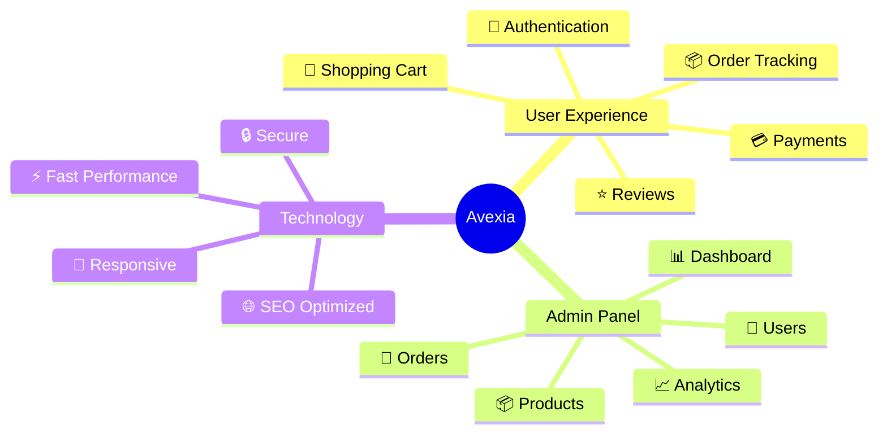
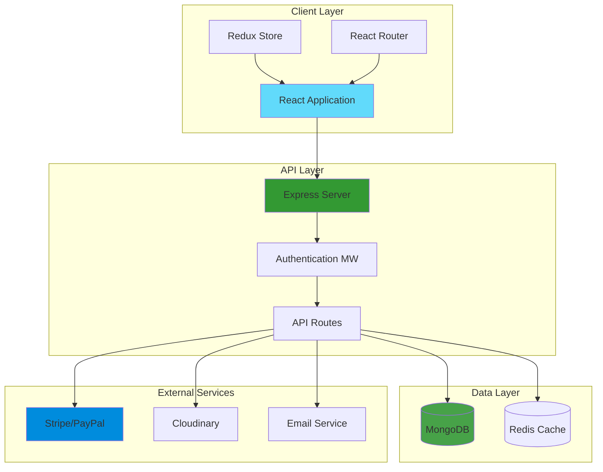
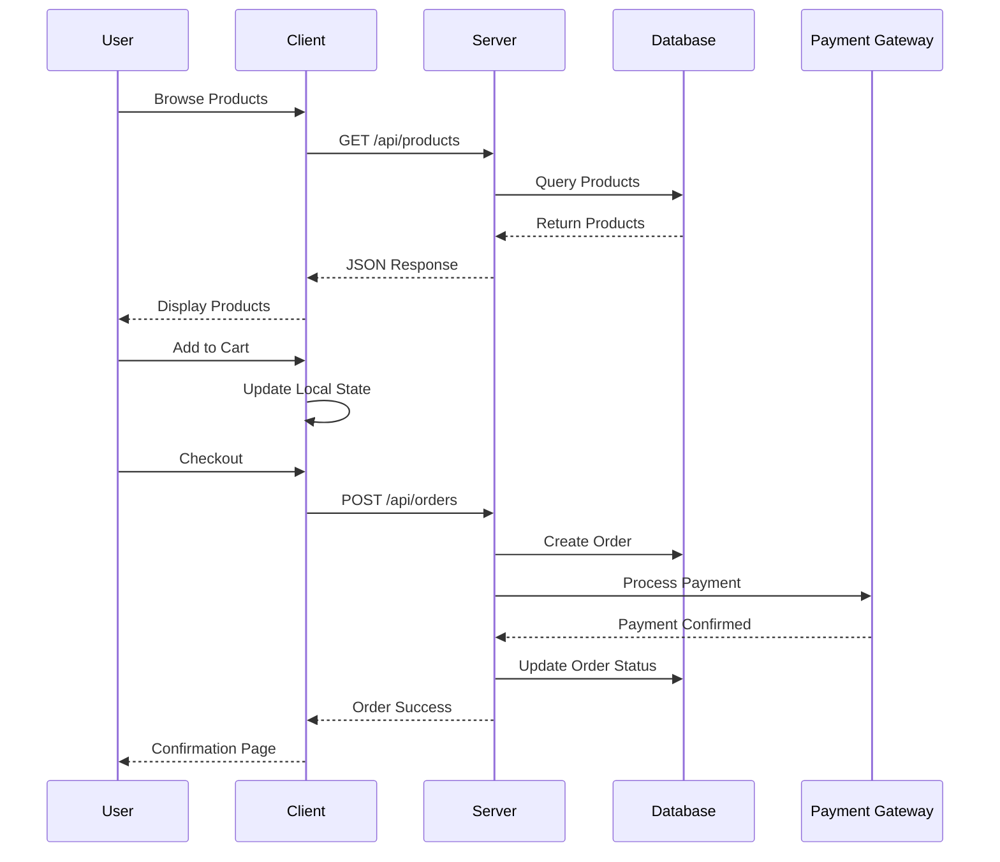
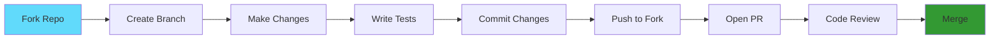

<div align="center">

# 🛍️ Avexia

### Modern Full-Stack E-Commerce Platform

[](https://github.com/yourusername/avexia)
[](https://www.mongodb.com/)
[](https://expressjs.com/)
[](https://reactjs.org/)
[](https://nodejs.org/)

[](LICENSE)
[](CONTRIBUTING.md)
[](https://github.com/yourusername/avexia/graphs/commit-activity)

**A production-ready e-commerce solution with modern architecture and seamless user experience**

[Features](#-features) • [Installation](#-installation) • [Tech Stack](#-tech-stack) • [Architecture](#-architecture) • [API](#-api-reference) • [Contributing](#-contributing)

---


</div>

## 🌟 Features

<div align="center">



</div>

### 🎯 Core Capabilities

<table>
<tr>
<td width="50%" valign="top">

#### 👤 Customer Features
```
✅ Secure JWT Authentication
✅ Product Search & Filtering
✅ Real-time Cart Management
✅ Multiple Payment Options
✅ Order History Dashboard
✅ Product Reviews & Ratings
✅ Wishlist Functionality
✅ AI Recommendations
✅ Email Notifications
✅ Mobile Responsive UI
```

</td>
<td width="50%" valign="top">

#### 🔧 Admin Dashboard
```
✅ Sales Analytics Dashboard
✅ Product CRUD Operations
✅ User Management System
✅ Order Processing Tools
✅ Inventory Tracking
✅ Revenue Reports
✅ Image Management
✅ Category Control
✅ Stock Alerts
✅ Role-Based Access
```

</td>
</tr>
</table>

---

## 🏗️ System Architecture

<div align="center">



</div>

---

## 🚀 Tech Stack

<div align="center">

### Frontend Technologies


### Backend Technologies


### Payment & Cloud Services


### Development & Testing


</div>

---

## 📊 Data Flow Diagram

<div align="center">



</div>

---

## 📦 Installation

<div align="center">

### Quick Start Guide

</div>

```bash
# 1️⃣ Clone the repository
git clone https://github.com/yourusername/avexia.git
cd avexia

# 2️⃣ Install backend dependencies
cd backend
npm install

# 3️⃣ Install frontend dependencies
cd ../frontend
npm install

# 4️⃣ Setup environment variables
cp backend/.env.example backend/.env
# Edit .env with your credentials

# 5️⃣ Start MongoDB (if running locally)
mongod

# 6️⃣ Run the application
# Terminal 1 - Backend
cd backend
npm run dev

# Terminal 2 - Frontend
cd frontend
npm start
```

<div align="center">

### 🎉 Application Running

**Frontend:** `http://localhost:3000` | **Backend:** `http://localhost:5000`

</div>

---

## ⚙️ Configuration

<details>
<summary><b>📝 Environment Variables</b></summary>

### Backend (.env)

```env
# Server Configuration
NODE_ENV=development
PORT=5000
CLIENT_URL=http://localhost:3000

# Database
MONGODB_URI=mongodb://localhost:27017/avexia
MONGODB_TEST_URI=mongodb://localhost:27017/avexia_test

# Authentication
JWT_SECRET=your_super_secret_jwt_key_change_in_production
JWT_EXPIRE=7d
JWT_COOKIE_EXPIRE=7

# Payment Gateways
STRIPE_SECRET_KEY=sk_test_your_stripe_secret_key
STRIPE_PUBLISHABLE_KEY=pk_test_your_stripe_publishable_key
PAYPAL_CLIENT_ID=your_paypal_client_id
PAYPAL_CLIENT_SECRET=your_paypal_client_secret

# Email Configuration
EMAIL_SERVICE=gmail
EMAIL_HOST=smtp.gmail.com
EMAIL_PORT=587
EMAIL_USER=your_email@gmail.com
EMAIL_PASSWORD=your_app_specific_password
EMAIL_FROM=noreply@avexia.com

# Cloud Storage
CLOUDINARY_CLOUD_NAME=your_cloud_name
CLOUDINARY_API_KEY=your_cloudinary_api_key
CLOUDINARY_API_SECRET=your_cloudinary_api_secret

# Redis (Optional - for caching)
REDIS_HOST=localhost
REDIS_PORT=6379
REDIS_PASSWORD=

# Security
COOKIE_SECRET=your_cookie_secret_key
RATE_LIMIT_WINDOW=15
RATE_LIMIT_MAX_REQUESTS=100
```

</details>

---

## 🔌 API Reference

<div align="center">

### RESTful API Endpoints

</div>

```mermaid
graph LR
    A[API /api] --> B[/auth]
    A --> C[/products]
    A --> D[/orders]
    A --> E[/users]
    A --> F[/cart]
    A --> G[/reviews]
    
    B --> B1[POST /register]
    B --> B2[POST /login]
    B --> B3[GET /profile]
    
    C --> C1[GET /]
    C --> C2[POST / Admin]
    C --> C3[PUT /:id Admin]
    
    D --> D1[GET /]
    D --> D2[POST /]
    D --> D3[GET /:id]
    
    style A fill:#339933
    style B fill:#61DAFB
    style C fill:#61DAFB
    style D fill:#61DAFB
```

<details>
<summary><b>🔐 Authentication Endpoints</b></summary>

| Method | Endpoint | Description | Auth |
|--------|----------|-------------|------|
| `POST` | `/api/auth/register` | Register new user | ❌ |
| `POST` | `/api/auth/login` | User login | ❌ |
| `POST` | `/api/auth/logout` | User logout | ✅ |
| `GET` | `/api/auth/profile` | Get user profile | ✅ |
| `PUT` | `/api/auth/profile` | Update profile | ✅ |
| `POST` | `/api/auth/forgot-password` | Request password reset | ❌ |
| `PUT` | `/api/auth/reset-password/:token` | Reset password | ❌ |

</details>

<details>
<summary><b>🛍️ Product Endpoints</b></summary>

| Method | Endpoint | Description | Auth |
|--------|----------|-------------|------|
| `GET` | `/api/products` | Get all products | ❌ |
| `GET` | `/api/products/:id` | Get single product | ❌ |
| `POST` | `/api/products` | Create product | 🔒 Admin |
| `PUT` | `/api/products/:id` | Update product | 🔒 Admin |
| `DELETE` | `/api/products/:id` | Delete product | 🔒 Admin |
| `GET` | `/api/products/search?q=` | Search products | ❌ |
| `GET` | `/api/products/category/:cat` | Get by category | ❌ |

</details>

<details>
<summary><b>📦 Order Endpoints</b></summary>

| Method | Endpoint | Description | Auth |
|--------|----------|-------------|------|
| `GET` | `/api/orders` | Get user orders | ✅ |
| `GET` | `/api/orders/:id` | Get order details | ✅ |
| `POST` | `/api/orders` | Create new order | ✅ |
| `PUT` | `/api/orders/:id/pay` | Update to paid | ✅ |
| `PUT` | `/api/orders/:id/deliver` | Update to delivered | 🔒 Admin |
| `GET` | `/api/orders/admin/all` | Get all orders | 🔒 Admin |

</details>

<details>
<summary><b>🛒 Cart Endpoints</b></summary>

| Method | Endpoint | Description | Auth |
|--------|----------|-------------|------|
| `GET` | `/api/cart` | Get user cart | ✅ |
| `POST` | `/api/cart/add` | Add item to cart | ✅ |
| `PUT` | `/api/cart/update/:id` | Update cart item | ✅ |
| `DELETE` | `/api/cart/remove/:id` | Remove from cart | ✅ |
| `DELETE` | `/api/cart/clear` | Clear entire cart | ✅ |

</details>

---

## 📁 Project Structure

```
avexia/
│
├── 📂 backend/
│   ├── 📂 config/
│   │   ├── db.js              # Database connection
│   │   └── cloudinary.js      # Cloudinary setup
│   │
│   ├── 📂 controllers/
│   │   ├── authController.js  # Authentication logic
│   │   ├── productController.js
│   │   ├── orderController.js
│   │   └── userController.js
│   │
│   ├── 📂 middleware/
│   │   ├── auth.js            # JWT verification
│   │   ├── error.js           # Error handler
│   │   └── validator.js       # Input validation
│   │
│   ├── 📂 models/
│   │   ├── User.js
│   │   ├── Product.js
│   │   ├── Order.js
│   │   └── Review.js
│   │
│   ├── 📂 routes/
│   │   ├── authRoutes.js
│   │   ├── productRoutes.js
│   │   ├── orderRoutes.js
│   │   └── userRoutes.js
│   │
│   ├── 📂 utils/
│   │   ├── sendEmail.js
│   │   ├── generateToken.js
│   │   └── imageUpload.js
│   │
│   ├── .env
│   ├── .env.example
│   ├── server.js              # Entry point
│   └── package.json
│
├── 📂 frontend/
│   ├── 📂 public/
│   │   └── index.html
│   │
│   ├── 📂 src/
│   │   ├── 📂 components/
│   │   │   ├── Header.jsx
│   │   │   ├── Footer.jsx
│   │   │   ├── ProductCard.jsx
│   │   │   └── Loader.jsx
│   │   │
│   │   ├── 📂 pages/
│   │   │   ├── Home.jsx
│   │   │   ├── ProductDetails.jsx
│   │   │   ├── Cart.jsx
│   │   │   ├── Checkout.jsx
│   │   │   └── Dashboard.jsx
│   │   │
│   │   ├── 📂 redux/
│   │   │   ├── store.js
│   │   │   ├── slices/
│   │   │   │   ├── authSlice.js
│   │   │   │   ├── cartSlice.js
│   │   │   │   └── productSlice.js
│   │   │
│   │   ├── 📂 services/
│   │   │   └── api.js         # Axios setup
│   │   │
│   │   ├── 📂 utils/
│   │   │   └── helpers.js
│   │   │
│   │   ├── App.jsx
│   │   ├── index.js
│   │   └── index.css
│   │
│   └── package.json
│
├── 📄 README.md
├── 📄 LICENSE
└── 📄 .gitignore
```

---

## 🧪 Testing

<div align="center">

### Test Coverage


</div>

```bash
# Run all tests
npm test

# Run tests with coverage report
npm run test:coverage

# Run tests in watch mode (development)
npm run test:watch

# Run E2E tests
npm run test:e2e

# Run specific test file
npm test -- productController.test.js
```

---

## 🚦 Performance Metrics

<div align="center">

| Metric | Target | Current |
|--------|--------|---------|
| ⚡ Page Load Time | < 3s | 2.1s |
| 🎯 First Contentful Paint | < 1.5s | 1.2s |
| 📊 Time to Interactive | < 3.5s | 2.8s |
| 💯 Lighthouse Score | > 90 | 94 |
| 📱 Mobile Performance | > 85 | 89 |

</div>

---

## 🤝 Contributing

<div align="center">

**We love contributions!** 

[](https://github.com/yourusername/avexia/graphs/contributors)
[](https://github.com/yourusername/avexia/network/members)
[](https://github.com/yourusername/avexia/stargazers)
[](https://github.com/yourusername/avexia/issues)

</div>

### Contribution Workflow



1. 🍴 **Fork** the repository
2. 🌿 **Create** your feature branch: `git checkout -b feature/AmazingFeature`
3. ✍️ **Commit** your changes: `git commit -m 'Add AmazingFeature'`
4. 📤 **Push** to the branch: `git push origin feature/AmazingFeature`
5. 🔃 **Open** a Pull Request

---

## 📜 License

<div align="center">

Distributed under the **MIT License**

[](https://opensource.org/licenses/MIT)

See `LICENSE` file for more information.

</div>

---

## 👨‍💻 Author

<div align="center">

### Dev Jariwala

[](https://github.com/DevJariwala5)
[](https://linkedin.com/in/devjariwala)
[](https://devjariwala.com)
[](mailto:dev@avexia.com)

</div>

---

## 🙏 Acknowledgments

<div align="center">

Special thanks to all contributors and the open-source community!

```
⭐ Star this repo if you find it helpful!
🐛 Report bugs and request features via Issues
💬 Join our community discussions
```

</div>

---

<div align="center">

### 💼 Built for Production • 🚀 Ready to Scale • 💎 Enterprise Quality

**Made with ❤️ by Dev Jariwala**


</div>